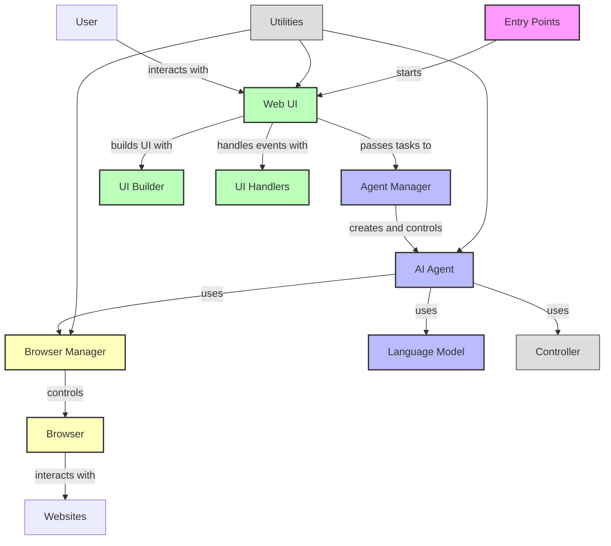
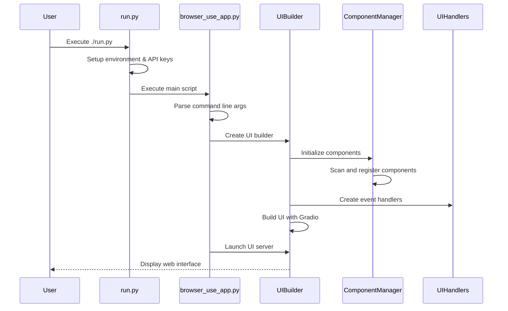
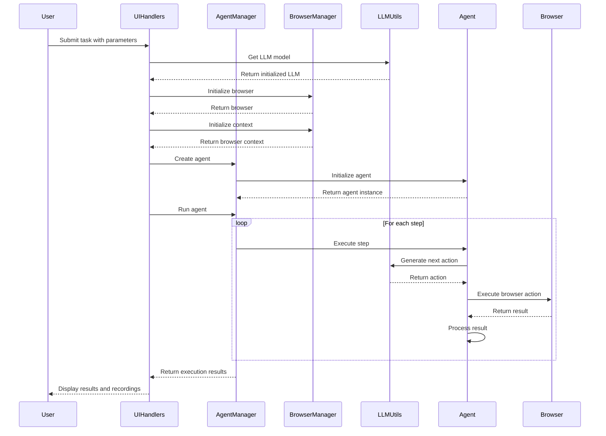

# Browser Use App

A web interface for browser automation with AI agents.

## Overview

This application provides a Gradio-based web UI for controlling AI agents that can interact with web browsers. It's built with modularity, scalability, and ease of use in mind.

## Features

- 🌐 **Browser Automation**: Control Chrome/Chromium browsers with AI
- 🧠 **Multiple LLM Providers**: Support for OpenAI, Anthropic, Google, and more
- 🎨 **Customizable UI**: Multiple themes and layouts
- 📊 **Recording & History**: Save agent sessions and browser recordings
- 🛠️ **Extensible**: Modular design for adding new features

## Architecture

The Computer Use Agent (CUA) is an AI-powered browser automation system that allows intelligent agents to control a web browser to complete tasks. The architecture follows a modular design with clear separation of concerns across multiple components.

### System Overview



### Key Components

#### Entry Points
- **run.py**: Wrapper script that sets up the environment and runs the application
- **browser_use_app.py**: Main entry point that initializes and launches the UI

#### Core Components
- **Agent**: Executes tasks by controlling the browser using an LLM
- **AgentManager**: Manages agent lifecycle and provides a clean interface for the UI
- **BrowserManager**: Handles browser initialization and lifecycle

#### UI Components
- **UIBuilder**: Constructs the Gradio web interface
- **UIHandlers**: Handles UI events and coordinates with backend components
- **ComponentManager**: Manages UI components and their registration

#### Utility Components
- **LLMUtils**: Provides access to various language models (OpenAI, Anthropic, etc.)
- **FileUtils**: Handles file operations like saving recordings
- **EnvUtils**: Manages environment variables and sensitive information

### Component Interaction Flow

#### Application Startup Flow



#### Agent Execution Flow



For more detailed architecture information, see [ARCHITECTURE.md](docs/ARCHITECTURE.md).

## Directory Structure

```
cua/
├── browser_use_app.py           # Main application entry point
├── run.py                       # Wrapper script to run the application
├── browser_use_ui/              # Main package
│   ├── __init__.py              # Package initialization
│   ├── agent/                   # Agent core components
│   │   ├── custom_agent.py      # Custom agent implementation
│   │   ├── custom_prompts.py    # Agent prompts
│   │   └── ...
│   ├── agents/                  # Agent management
│   │   ├── agent_manager.py     # Agent lifecycle management
│   │   └── ...
│   ├── browser/                 # Browser control
│   │   ├── browser_manager.py   # Browser lifecycle management
│   │   ├── custom_browser.py    # Custom browser implementation
│   │   └── ...
│   ├── controller/              # Control logic
│   │   ├── custom_controller.py # Custom controller
│   │   └── ...
│   ├── ui/                      # Web interface
│   │   ├── ui_builder.py        # UI construction
│   │   ├── handlers.py          # Event handlers
│   │   ├── component_manager.py # UI component management
│   │   └── ...
│   └── utils/                   # Utilities
│       ├── llm_utils.py         # LLM integration
│       ├── file_utils.py        # File operations
│       ├── env_utils.py         # Environment helpers
│       └── ...
├── scripts/                     # Helper scripts
│   ├── run_app.sh               # Shell script to run application
│   ├── direct_run.sh            # Script with direct environment setup
│   └── ...
└── docs/                        # Documentation
    ├── ARCHITECTURE.md          # Detailed architecture docs
    └── ...
```

## Installation

### Prerequisites

- Python 3.9+
- Chrome or Chromium browser
- An API key for at least one LLM provider

### Setup

1. Clone the repository:
   ```bash
   git clone https://github.com/yourusername/cua.git
   cd cua
   ```

2. Create a virtual environment:
   ```bash
   python -m venv venv
   ```

3. Activate the virtual environment:
   ```bash
   # On Windows
   venv\Scripts\activate
   
   # On macOS/Linux
   source venv/bin/activate
   ```

4. Install the dependencies:
   ```bash
   pip install -r requirements.txt
   ```

5. Copy the example environment file and edit it:
   ```bash
   cp .env.example .env
   # Edit .env with your API keys
   ```

## Running the App

### Using the Script

The easiest way to run the application is using the provided script:

```bash
./scripts/run_app.sh
```

This script will activate the virtual environment and start the application.

### Using Python Directly

Alternatively, you can run the application directly:

```bash
python browser_use_app.py --ip 127.0.0.1 --port 7788
```

### Using Docker

```bash
docker-compose up -d
```

## Usage

1. Open your browser and navigate to `http://127.0.0.1:7788`
2. Configure the agent settings and LLM provider
3. Enter a task for the agent
4. Click "Run Agent" to execute

## Development

### Adding New Features

- For new UI components: modify `browser_use_ui/ui/ui_builder.py`
- For new event handlers: modify `browser_use_ui/ui/handlers.py`
- For new LLM providers: modify `browser_use_ui/utils/llm_utils.py`

### Running Tests

```bash
pytest tests/
```

## License

This project is licensed under the MIT License - see the LICENSE file for details. 