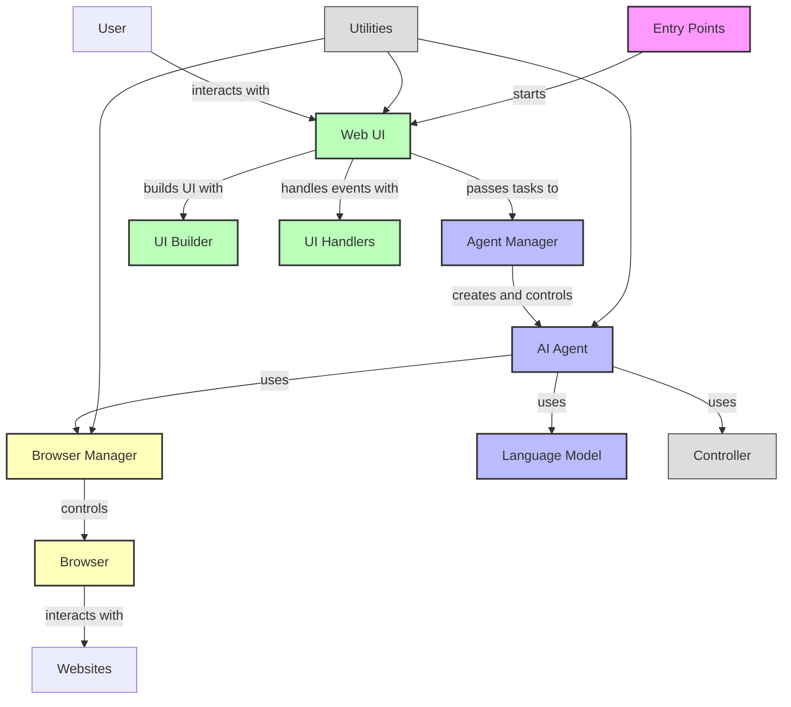
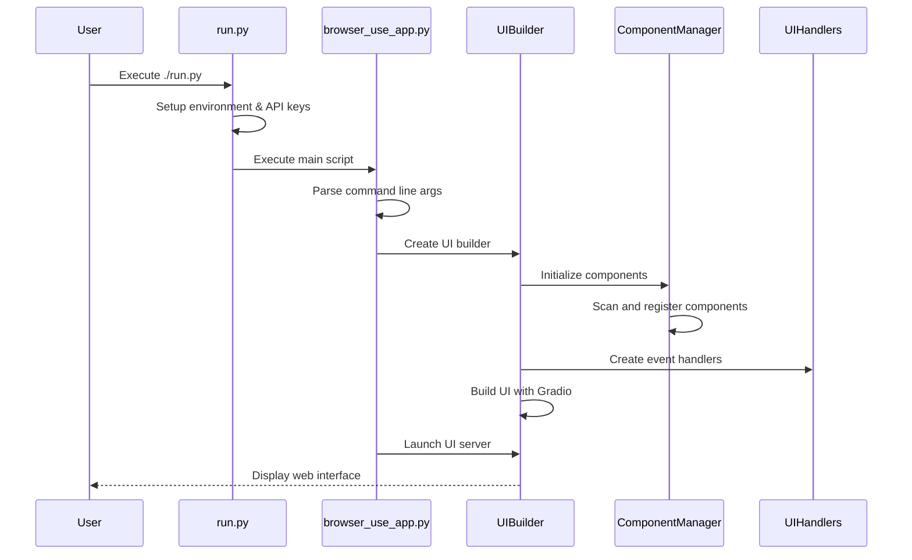
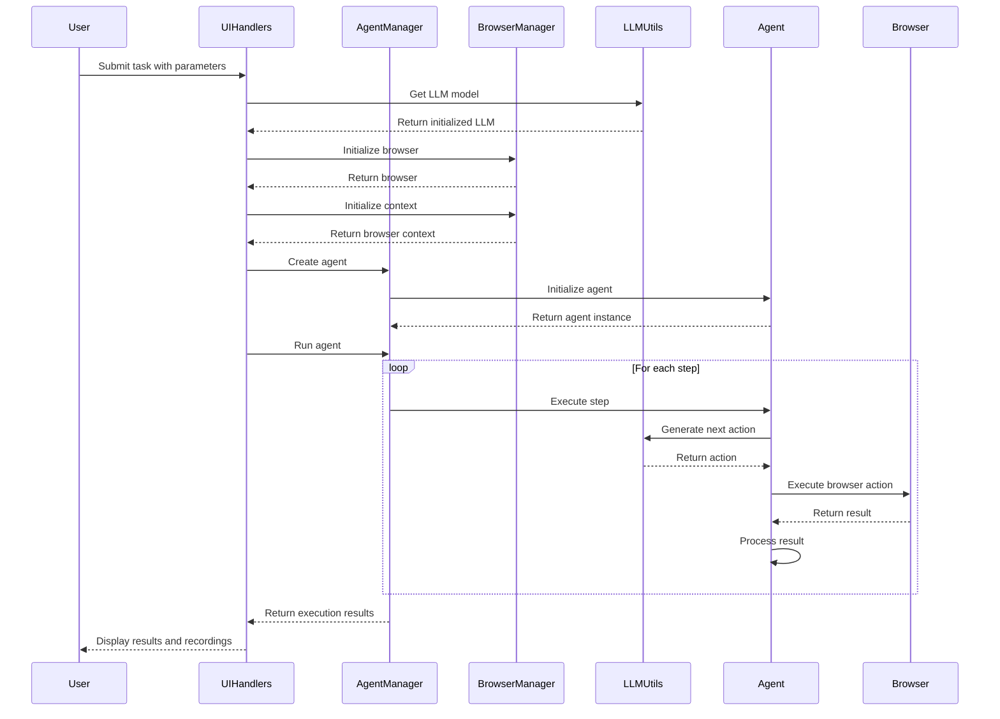

# Computer Use Agent (CUA) Architecture

## 1. System Overview

The Computer Use Agent (CUA) is an AI-powered browser automation system that allows intelligent agents to control a web browser to complete tasks. The architecture follows a modular design with clear separation of concerns across multiple components.



## 2. Directory Structure

The CUA codebase is organized into a logical directory structure that reflects the architecture:

```
cua/
├── browser_use_app.py           # Main application entry point
├── run.py                       # Wrapper script to run the application
├── browser_use_ui/              # Main package
│   ├── __init__.py              # Package initialization
│   ├── agent/                   # Agent core components
│   │   ├── custom_agent.py      # Custom agent implementation
│   │   ├── custom_prompts.py    # Agent prompts
│   │   └── ...
│   ├── agents/                  # Agent management
│   │   ├── agent_manager.py     # Agent lifecycle management
│   │   └── ...
│   ├── browser/                 # Browser control
│   │   ├── browser_manager.py   # Browser lifecycle management
│   │   ├── custom_browser.py    # Custom browser implementation
│   │   └── ...
│   ├── controller/              # Control logic
│   │   ├── custom_controller.py # Custom controller
│   │   └── ...
│   ├── ui/                      # Web interface
│   │   ├── ui_builder.py        # UI construction
│   │   ├── handlers.py          # Event handlers
│   │   ├── component_manager.py # UI component management
│   │   └── ...
│   └── utils/                   # Utilities
│       ├── llm_utils.py         # LLM integration
│       ├── file_utils.py        # File operations
│       ├── env_utils.py         # Environment helpers
│       └── ...
├── scripts/                     # Helper scripts
│   ├── run_app.sh               # Shell script to run application
│   ├── direct_run.sh            # Script with direct environment setup
│   └── ...
└── docs/                        # Documentation
    ├── ARCHITECTURE.md          # This file
    └── ...
```

## 3. Component Interaction Flow

### Application Startup Flow



### Agent Execution Flow



## 4. Key Components

### Entry Points

- **run.py**: Wrapper script that sets up the environment and runs the application
- **browser_use_app.py**: Main entry point that initializes and launches the UI

### Core Components

- **Agent**: Executes tasks by controlling the browser using an LLM
- **AgentManager**: Manages agent lifecycle and provides a clean interface for the UI
- **BrowserManager**: Handles browser initialization and lifecycle

### UI Components

- **UIBuilder**: Constructs the Gradio web interface
- **UIHandlers**: Handles UI events and coordinates with backend components
- **ComponentManager**: Manages UI components and their registration

### Utility Components

- **LLMUtils**: Provides access to various language models (OpenAI, Anthropic, etc.)
- **FileUtils**: Handles file operations like saving recordings
- **EnvUtils**: Manages environment variables and sensitive information

## 5. Integration with External Systems

The CUA system integrates with several external services and libraries:

- **Language Models**: OpenAI, Anthropic, Mistral, Ollama, Google (via API)
- **Browser Automation**: Playwright (via browser_use library)
- **Web Interface**: Gradio for building the interactive UI
- **Environment Management**: python-dotenv for configuration

## 6. Deployment Options

The system can be deployed in several ways:

1. **Direct execution**: Using the `run.py` or `scripts/direct_run.sh` scripts
2. **Docker container**: Using the provided Dockerfile
3. **Docker Compose**: Using the docker-compose.yml for more complex setups

## 7. Development Workflow

For developing new features:

1. Understand the component structure and identify where changes are needed
2. Make changes to isolated components to maintain separation of concerns
3. Test the changes through the UI or with unit tests
4. Update documentation to reflect architectural changes

This architecture document provides a high-level overview of the Computer Use Agent system. For more detailed information about specific components, refer to the inline documentation in the respective files. 